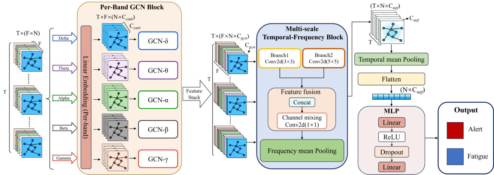
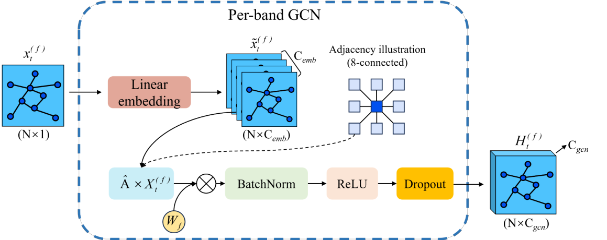
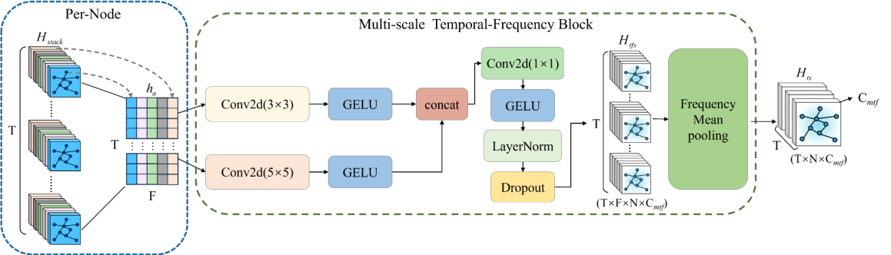

# PBG-MTFNet

**Per-band Graph Convolution and Multi-scale Temporal-Frequency Modeling for EEG Fatigue Detection**

PBG-MTFNet models electrode-level spatial dependencies, frequency-specific EEG patterns, and temporal interactions across frequency bands. This repository presents the project architecture and original PyTorch code, including the main model, leave-one-subject-out (LOSO) experiments, ablations, and comparison models.



## Design rationale

EEG electrodes have a spatial organization, while different frequency bands can carry different fatigue-related patterns. PBG-MTFNet therefore encodes each band with an independent graph branch before combining the resulting features across time and frequency.

The model takes an input tensor of shape **(B, T, F, N)**: batch size, temporal windows, frequency bands, and electrode nodes. The five bands are Delta, Theta, Alpha, Beta, and Gamma.

## Model architecture

### Per-band graph convolution

Each frequency band has its own linear embedding and graph convolution parameters. The branches use a shared electrode topology, with connections derived from neighboring electrode positions on an 8 × 9 grid. Graph convolution, batch normalization, ReLU, and dropout produce band-specific spatial features.



### Multi-scale temporal-frequency modeling

The graph features are stacked across bands. Parallel **3 × 3** and **5 × 5** convolutions operate over the time-frequency axes at each electrode. Their outputs are concatenated and mixed by a **1 × 1** convolution, followed by normalization and dropout. Frequency averaging and temporal averaging lead to a lightweight MLP classifier for alert/fatigue prediction.



The implementation class is named `STGCN_PB_TFConv_T35_F5_FC`; the project name is **PBG-MTFNet**. The main implementation is in the `F5T35` folders. Some historical comments mention a 3 × 5 branch, but the main model's executable convolution uses **3 × 3**, as shown above.

## Repository layout

```text
experiments/
├── seed_model/                 # SEED-VIG experiments
│   ├── F5T35/                  # Main PBG-MTFNet model
│   ├── LOSO/                   # Leave-one-subject-out scripts
│   ├── F3T3/                   # Single-scale variant
│   ├── F5T5/                   # Single-scale variant
│   ├── F5T35_gongxiangGCN/      # Shared-GCN variant
│   ├── fenli_F5T35/            # Separated frequency/temporal variant
│   ├── No_GCN/                 # Without graph convolution
│   └── No_TF/                  # Without temporal-frequency module
├── SADT_model/                 # Corresponding SADT experiments
└── duibi/                      # Comparison model implementations
    ├── SEED/
    └── SADT/
docs/
├── figures/                    # Original figures extracted from project PDF
└── REPRODUCIBILITY.md           # Implementation and validation notes
```

Each experiment folder contains its own model, data loader, and training script. Comparison folders include EEGNet, ESTCNN, MSCNN_CAM, SFT, CSFGNeT, AMS_CNN, EEG_CONV, and EEG_CONV_R. Their folder names identify the archived implementations; this repository does not claim that these are official upstream implementations.

## Implementation environment

The project report specifies **Python 3.10** and **PyTorch 2.4.0**. Dependencies are listed in `requirements.txt`; this is not a fully locked environment.

```bash
python -m venv .venv
# Activate the environment using the command appropriate for your shell.
python -m pip install -r requirements.txt
```

The main mixed-subject scripts use AdamW, cross-entropy loss, `ReduceLROnPlateau`, gradient clipping, and dropout. Their default configuration is 150 epochs, batch size 256, learning rate 0.005, weight decay 0.002, and a 60/20/20 random sample split. Checkpoints are selected by validation accuracy.

## Snapshot status

This repository contains **97 original Python source files**, project documentation, and three diagrams extracted from the author's project report. It is intended to showcase the code and project.

**No third-party datasets, raw recordings, processed samples, labels, or trained model weights are distributed in this repository.**

Static syntax and local-import checks are recorded in [reproducibility notes](docs/REPRODUCIBILITY.md). Full training has not been rerun for this repository, and no benchmark scores are asserted here. Review the implementation notes before treating the scripts as a validated reproduction package.
